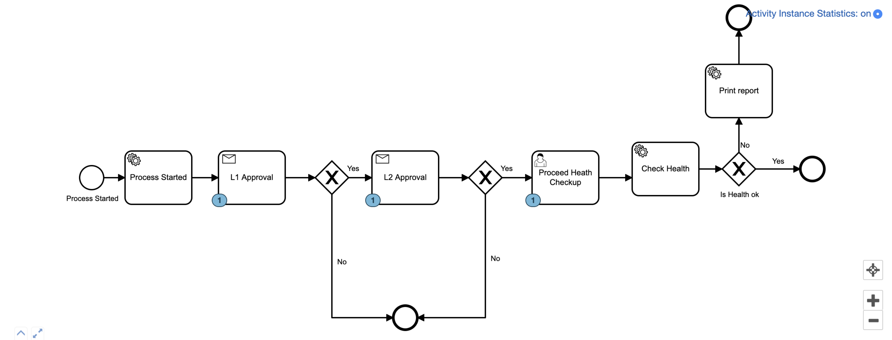

# camunda BPM - Getting Started with camunda BPM and Spring Boot

This Repository contains the example Spring Boot application for the guide at [camunda.org](http://camunda.org/get-started/spring-boot.html).


##Simple Workflow



```
It uses embeded databse so data will be erased on restart

Run Webapp*Application.java to start the application

```

```
CockPit URL : http://localhost:8080/
```

## Can Create a Process using below steps
```
Use cockpit to create a process or use below http call:

localhost:8080/rest/engine/default/process-definition/key/SimpleDemo/start

Method: POST

Body:

{
	"businessKey":"test3"
}
```

## Can send a message using below API call Will approve the task that is waiting for given activity

```
localhost:8080/rest/engine/default/message

BODY:

{
    "messageName":"ApproveL1",
    "businessKey": "test1",
    
    "processVariables": {
        "ApproveL1": {
            "value": "true",
            "type": "Boolean"
        }
        
    }
}
```

## Skipping a task

```
localhost:8080/rest/engine/default/process-instance/00041721-ce0f-11e9-a084-acde48001122/modification

BODY:

{
    "skipCustomListeners": true,
    "skipIoMappings": true,
    "instructions": [
        {
            "type": "startAfterActivity",
            "activityId": "L2approval",
            "variables": {
                "ApproveL2": {
                    "value": true,
                    "type": "Boolean"
                }
            }
        },
        {
            "type": "cancel",
            "activityId": "L1Approval",
            "cancelCurrentActiveActivityInstances": true
        }
    ]
}

```

###Fetch List of Task:

```
GET URL: localhost:8080/rest/engine/default/task/

```

## Fetch Instance details

```
GET: localhost:8080/rest/engine/default/process-instance/025a3c27-ce0f-11e9-a084-acde48001122/activity-instances

```
